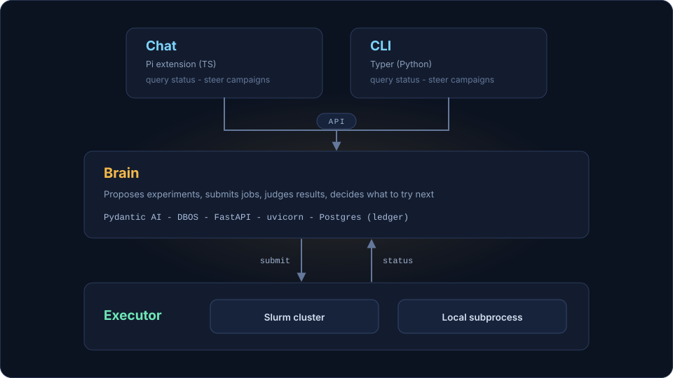

# Faberon

[Sevren](https://sevren.ai)'s autonomous ML research harness.

Faberon runs Machine Learning research autonomously. Give it a research plan and it proposes experiments, submits training jobs, waits for results, judges them against your expectations, and decides what to try next. Every decision is recorded in an append-only ledger, and you can steer it mid-run.

> ⚠️ STATUS
> 
> This repo is currently in early beta. Expect rough edges and breaking changes. Nevertheless, enjoy tinkering with it ;-)

**Features**:

- Runs ML research end to end: proposes an experiment, trains it, judges the result, and picks the next one. No babysitting.
- Every decision and its rational is recorded in a database.
- Every experiment is a git commit. Good ones stay, bad ones get reverted. Your repo ends up holding the best result.
- Survives crashes and reboots: kill Faberon mid-campaign and it picks up exactly where it left off.
- Built for Slurm clusters, but also runs on a single workstation or GPU box.
- A human can steer campaigns while they're running: inject ideas, cancel, or resume.
- To manage campaigns and watch progress live, both a chat interface and a comprehensive CLI are provided.
- Works with any LLM, including local and open ones.
- Proven end to end against Karpathy's [autoresearch](https://github.com/karpathy/autoresearch) repo.

**Design**:

- The **brain** is a durable agent loop behind a small HTTP API (FastAPI)
   - An LLM proposes the next experiment (Pydantic AI), DBOS checkpoints, a reboot resumes mid-campaign.
- The **chat** interface ("Faberon Chat") is a Pi extension for requesting status and steering campaigns from a chat session.
- The **CLI** (Typer) covers the same operations from a shell (no LLM required).
- Two **executors** are currently implemented: a Slurm cluster or a local workstation.
- The **ledger** is an append-only event log in Postgres. Every decision is recorded with its actor and reason.



For more details, see [design.md](docs/design/design.md).

## Install

### Prerequisites
Pick the guide for your machine. Each installs Postgres, Node, and the Pi CLI:
- [Install on a workstation](docs/install-workstation.md): you have sudo
- [Install on a login node](docs/install-login-node.md): no sudo (e.g. cluster login node)


### Faberon brain and chat
With the prerequisites in place, install the Faberon brain and register the chat interface with Pi.

From PyPI and npm (once these are available):

```bash
uv venv

uv pip install faberon
pi install npm:@faberon/chat
```

or from source:
```bash
git clone https://github.com/sevren-ai/faberon
cd faberon

uv tool install packages/brain
pi install ./packages/chat
```

## Quickstart

> ⚠️ Faberon executes unsandboxed LLM-generated code, with your user's (or the Slurm job's) permissions, and it rewrites the target repo as it experiments. Only point it at repos and clusters where that is acceptable.

Start the API inside `tmux` or `screen` so it survives your SSH session:

```bash
faberon serve
```

With Faberon running, submit a campaign and watch it through the CLI:

```bash
faberon create plan.json my_repo  # start a campaign with a given plan for a specific repo
faberon list                      # list all campaigns with their live status
faberon show <id>                 # show the details of one particular campaign
faberon events <id> -f            # stream the events of one particular campaign
faberon cancel <id>               # cancel one particular campaign
```

Or do the same from a Pi chat session with the Faberon Chat extension loaded: ask it to list campaigns, inject an idea, draft a plan, etc.

```bash
faberon chat
```

The chat interface and CLI speak to the same API; use whichever suits the moment.

> See this [runbook](https://github.com/sevren-ai/faberon/discussions/61) for using v0.3.0 on a local workstation.

## Future work

The following features are [planned](docs/design/roadmap.md) for the very near future:

- Running experiments in parallel (git worktrees and a job queue)
- Editing multiple files per experiment, and supporting repos that are not Python
- Sharper judgment: confidence measures, eval-suite regression checks, hard constraint gates
- Follow-up campaigns that start from the best kept commit of a finished campaign
- Security boundaries to guard against LLM-written code
- Multi-user campaigns with per-user identity, budgets, and approvals

## Feedback and contributing

- Found a bug? File an [issue](https://github.com/sevren-ai/faberon/issues).
- Have a feature idea (that is not yet planned for)? Post a new thread in the [discussion forum](https://github.com/sevren-ai/faberon/discussions/categories/feature-requests). For now we are not accepting feature pull requests.
- Ran Faberon and got some cool results? [Tell us](https://github.com/sevren-ai/faberon/discussions/categories/show-and-tell) all about it!
- Have a question or ran into a problem not covered by our [troubleshooting guide](docs/troubleshooting.md)? Ask it [here](https://github.com/sevren-ai/faberon/discussions/categories/q-a)!

For contributors and maintainers, see [CONTRIBUTING.md](CONTRIBUTING.md).

## License

The software is provided "as is" without warranty of any kind, under an MIT [LICENSE](LICENSE).
